# Production Line Analyzer

Static production line analysis based on reusable pattern.

# Demo
https://mehlko.github.io/model/

# How to use for demos

Here is a qlakthrough on how to use this software
Here you see the starting interface.
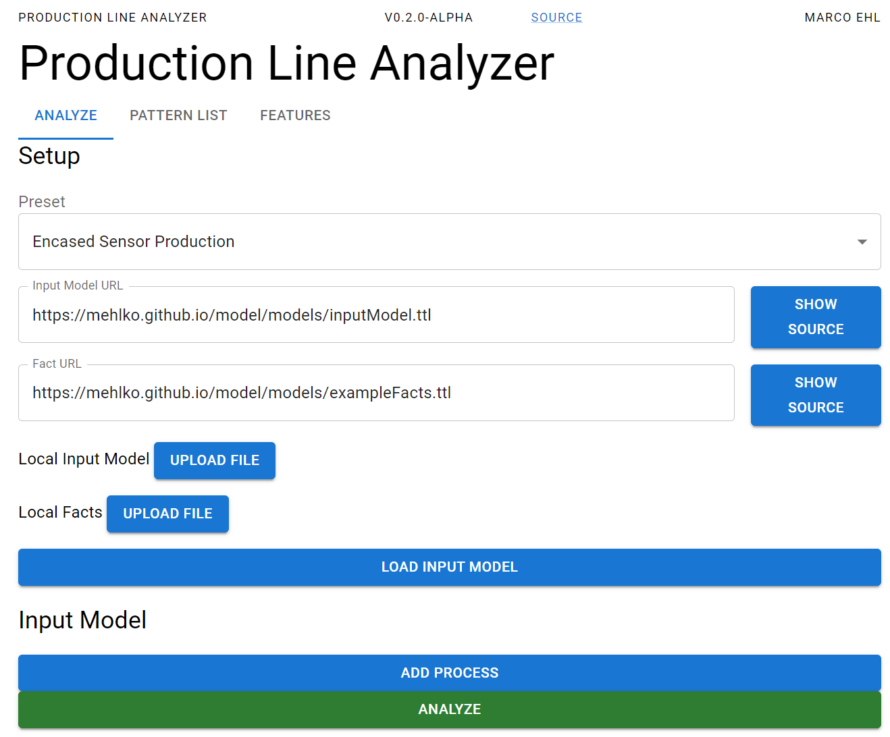
You can select presets to quickly load demo data.
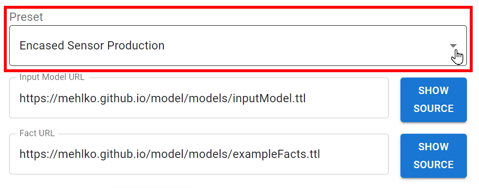
Pressing "LOAD INPUT MODEL" will load the ninput model.
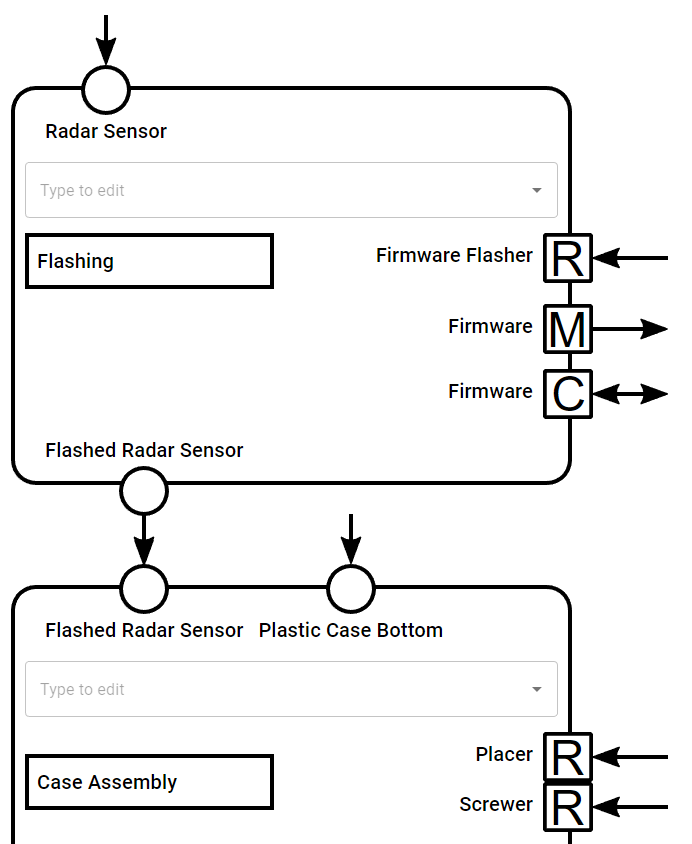
This will display the loaded model.
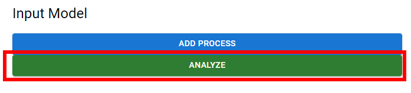
Pressing "ANALYZE" will analyse the model with our pattern (read more about pattern in the section Pattern) and show where the pattern is applicable and highlight those parts.
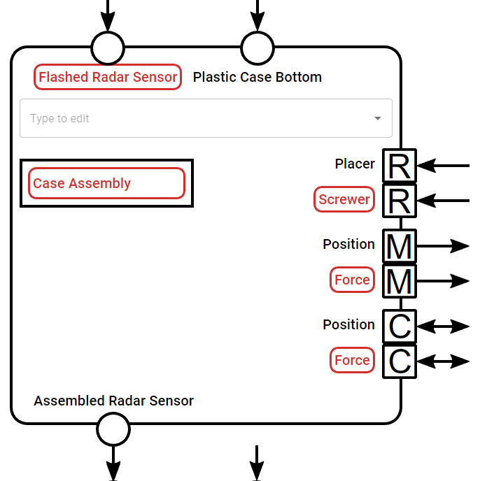
At the bottom the is a list of of the applicable pattern
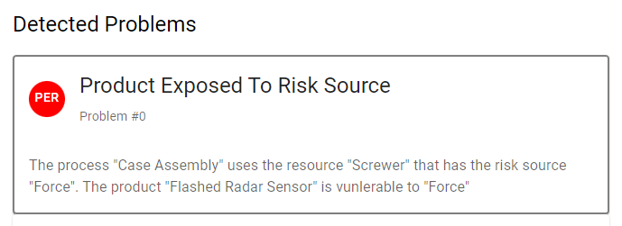

# How to use for production data

At the top of the page select "Blank (Allows importing confidential data)"
Then press "Local Input Model UPLOAD FILE"
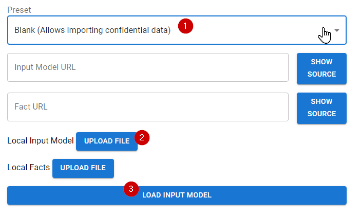
Select the desired file. The fill will be processedlocally in the browser.
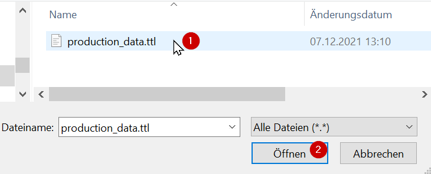
Then you can press "Load Input Model "
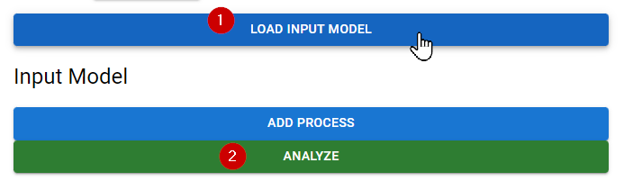
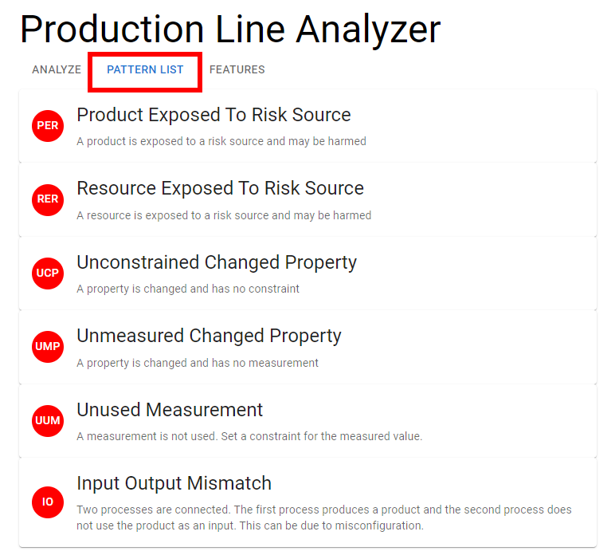


# Link to rendering component

https://github.com/mehlko/XapsModelRenderer

# Input Model
The input model and its meta-model are defined in RDF.
[Pattern](./model/inputModel.ttl)

Input Model
```
PREFIX model: <http://uni-ko-ld.de/ist/model#>
PREFIX prod: <http://uni-ko-ld.de/ist/product#>
PREFIX proc: <http://uni-ko-ld.de/ist/process#>
PREFIX res: <http://uni-ko-ld.de/ist/resource#>
PREFIX prop: <http://uni-ko-ld.de/ist/property#>

proc:SensorFlashing001 model:hasInputProduct prod:RadarSensor001.
proc:SensorFlashing001 model:hasResource res:FirmwareFlasher001.
proc:SensorFlashing001 model:hasMeasurement prop:Firmware001.
proc:SensorFlashing001 model:hasConstraint prop:Firmware001.
proc:SensorFlashing001 model:hasOutputProduct prod:FlashedRadarSensor001.
#
proc:SensorFlashing001 model:hasNextProcess proc:CaseAssembly001.
#
proc:CaseAssembly001 model:hasInputProduct prod:FlashedRadarSensor001.
proc:CaseAssembly001 model:hasInputProduct prod:PlasticCaseBottom001.
proc:CaseAssembly001 model:hasResource res:Placer001.
proc:CaseAssembly001 model:hasResource res:Screwer001.
proc:CaseAssembly001 model:hasMeasurement prop:Position001.
proc:CaseAssembly001 model:hasMeasurement prop:Force001.
proc:CaseAssembly001 model:hasConstraint prop:Position001.
proc:CaseAssembly001 model:hasConstraint prop:Force001.
proc:CaseAssembly001 model:hasOutputProduct prod:AssembledSensor001.
#
proc:CaseAssembly001 model:hasNextProcess proc:UltrasonicCaseSealing001.
#
proc:UltrasonicCaseSealing001 model:hasInputProduct prod:PlasticCaseTop001.
proc:UltrasonicCaseSealing001 model:hasInputProduct prod:AssembledSensor001.
proc:UltrasonicCaseSealing001 model:hasResource res:UltrasonicWelder001.
proc:UltrasonicCaseSealing001 model:hasOutputProduct prod:SealedSensor001.
#
proc:UltrasonicCaseSealing001 model:hasNextProcess proc:QualityControl001.
#
proc:QualityControl001 model:hasInputProduct prod:SealedSensor001.
proc:QualityControl001 model:hasResource res:PressureTester001.
proc:QualityControl001 model:hasResource res:Scale001.
proc:QualityControl001 model:hasMeasurement prop:LeakageRate001.
proc:QualityControl001 model:hasMeasurement prop:Weight001.
proc:QualityControl001 model:hasOutputProduct prod:TestedProduct001.
```

Meta-Model
```
PREFIX model: <http://uni-ko-ld.de/ist/model#>
PREFIX rdf:   <http://www.w3.org/1999/02/22-rdf-syntax-ns#>
PREFIX rdfs:   <http://www.w3.org/2000/01/rdf-schema#>


### Meta Model
model:Product rdf:type rdfs:Class.
model:Process rdf:type rdfs:Class.
model:Resource rdf:type rdfs:Class.
model:Property rdf:type rdfs:Class.

model:InputModelElement rdf:type rdfs:Class.

model:Product rdfs:subClassOf model:InputModelElement.
model:Process rdfs:subClassOf model:InputModelElement.
model:Resource rdfs:subClassOf model:InputModelElement.
model:Property rdfs:subClassOf model:InputModelElement.
```


# Pattern
You can show a pattern list inside the apllication.


Or you can look how the pattern are defined in the  source code:
[Pattern](./pattern.js)


## Relations
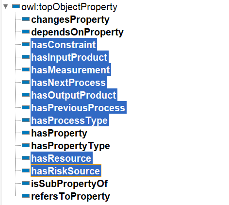